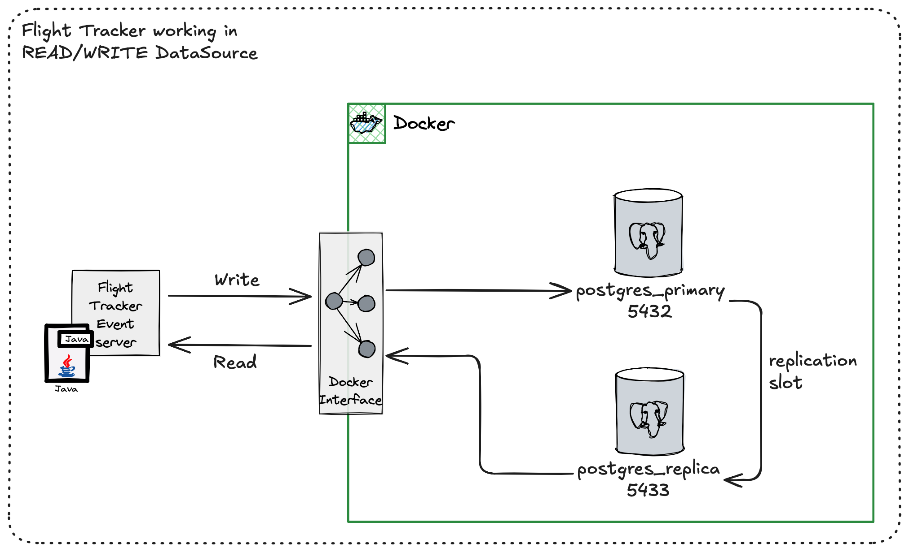
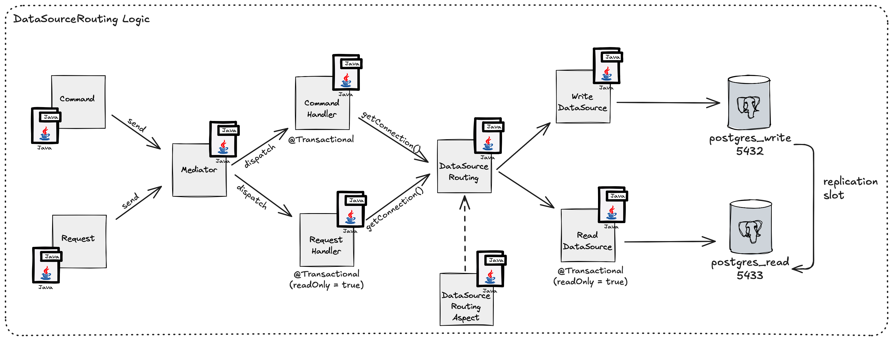

# Flight Tracker Event Server


A Spring Boot application for tracking flight events.

## Build Status

[](https://github.com/luismr/flight-tracker-event-server-java/actions/workflows/maven.yml)


## Getting Started

### Prerequisites

- Java 21
- Maven 3.9.6
- Docker and Docker Compose

### External Dependencies

The application requires the following external services:

- Redis 7.4
- PostgreSQL 17
- Apache Kafka 4

#### Using Docker Compose

The project includes a `docker-compose.yml` file that sets up all required services. To manage the services:

```bash
# Start all services
docker-compose up -d

# Stop all services
docker-compose down

# View logs for all services
docker-compose logs -f

# View logs for a specific service
docker-compose logs -f redis
docker-compose logs -f postgres
docker-compose logs -f kafka

# Restart a specific service
docker-compose restart redis
docker-compose restart postgres
docker-compose restart kafka

# Stop and remove all containers and volumes
docker-compose down -v
```

#### Service Details

- **Redis**
  - Port: 6379
  - No authentication required
  - Data persistence enabled

- **PostgreSQL**
  - Port: 5432
  - Database: flighttracker
  - Username: flighttracker
  - Password: flighttracker
  - Schema: flighttracker

- **Kafka**
  - Port: 9092
  - Auto topic creation enabled
  - Single broker configuration

#### Manual Service Management

If you prefer to manage services individually:

```bash
# Redis
docker run -d --name redis -p 6379:6379 redis:7.4

# PostgreSQL
docker run -d --name postgres \
  -e POSTGRES_USER=flighttracker \
  -e POSTGRES_PASSWORD=flighttracker \
  -e POSTGRES_DB=flighttracker \
  -p 5432:5432 \
  postgres:17

# Kafka
docker run -d --name kafka \
  -p 9092:9092 \
  -e KAFKA_BROKER_ID=1 \
  -e KAFKA_LISTENERS=PLAINTEXT://:9092 \
  -e KAFKA_ADVERTISED_LISTENERS=PLAINTEXT://localhost:9092 \
  -e KAFKA_AUTO_CREATE_TOPICS_ENABLE=true \
  apache/kafka:4
```

### Cloning the Repository

```bash
git clone git@github.com:luismr/flight-tracker-event-server-java.git
cd flight-tracker-event-server-java
```

### Building

```bash
mvn clean install
```

### Running

```bash
mvn spring-boot:run
```

## Contributing

1. Fork the repository
2. Create your feature branch (`git checkout -b feature/amazing-feature`)
3. Commit your changes (`git commit -m 'Add some amazing feature'`)
4. Push to the branch (`git push origin feature/amazing-feature`)
5. Open a Pull Request

## GitHub Actions Permissions

To enable automatic badge updates and coverage reports, ensure the following GitHub Actions permissions are set:

1. Go to your repository's Settings
2. Navigate to Actions > General
3. Under "Workflow permissions", select:
   - "Read and write permissions"
   - "Allow GitHub Actions to create and approve pull requests"

## Read Write Datasource Routing

  

The application supports read-write splitting for database operations. This feature is disabled by default but can be enabled through configuration.

### Configuration

```yaml
spring:
  datasource:
    writer:
      jdbcUrl: jdbc:postgresql://localhost:5432/flighttracker
      username: flighttracker
      password: flighttracker
      driverClassName: org.postgresql.Driver
      type: com.zaxxer.hikari.HikariDataSource
    reader:
      jdbcUrl: jdbc:postgresql://localhost:5433/flighttracker
      username: flighttracker
      password: flighttracker
      driverClassName: org.postgresql.Driver
      type: com.zaxxer.hikari.HikariDataSource

app:
  read-write-routing:
    enabled: false  # Set to true to enable read-write splitting
```

### Important Notes

1. When enabled, you must configure both write and read data sources
2. The routing is based on Spring's `@Transactional` annotation:
   - Read operations: Use `@Transactional(readOnly = true)`
   - Write operations: Use `@Transactional` or `@Transactional(readOnly = false)`



3. If read-write splitting is enabled but not properly configured, the application will fail to start
4. For development and testing, it's recommended to keep this feature disabled
5. The routing is handled by:
   - `DatasourceConfig`: Configures the data sources and routing
   - `RoutingDataSource`: Routes requests to the appropriate data source
   - `ReadWriteRoutingAspect`: Sets the context based on transaction type
   - `DbContextHolder`: Thread-local holder for the current context

## Project Structure

```
.
├── .github/
│   └── workflows/
│       └── maven.yml
├── src/
│   ├── main/
│   │   ├── java/
│   │   │   └── dev/
│   │   │       └── luismachadoreis/
│   │   │           └── flighttracker/
│   │   │               └── server/
│   │   │                   ├── common/
│   │   │                   │   ├── application/
│   │   │                   │   │   └── cqs/
│   │   │                   │   │       ├── command/
│   │   │                   │   │       │   ├── Command.java
│   │   │                   │   │       │   └── CommandHandler.java
│   │   │                   │   │       ├── query/
│   │   │                   │   │       │   ├── Query.java
│   │   │                   │   │       │   └── QueryHandler.java
│   │   │                   │   │       └── mediator/
│   │   │                   │   │           ├── Mediator.java
│   │   │                   │   │           └── SpringMediator.java
│   │   │                   │   └── infrastructure/
│   │   │                   │       ├── datasource/
│   │   │                   │       │   ├── DbContextHolder.java
│   │   │                   │       │   ├── ReadWriteRoutingAspect.java
│   │   │                   │       │   ├── ReadWriteRoutingProperties.java
│   │   │                   │       │   └── RoutingDataSource.java
│   │   │                   │       ├── DatasourceConfig.java
│   │   │                   │       ├── KafkaConfig.java
│   │   │                   │       └── OpenApiConfig.java
│   │   │                   ├── flightdata/
│   │   │                   │   └── infrastructure/
│   │   │                   │       ├── kafka/
│   │   │                   │       │   └── FlightDataConsumerConfig.java
│   │   │                   │       └── pubsub/
│   │   │                   │           └── FlightDataSubscriber.java
│   │   │                   ├── ping/
│   │   │                   │   ├── api/
│   │   │                   │   │   └── PingController.java
│   │   │                   │   ├── application/
│   │   │                   │   │   ├── dto/
│   │   │                   │   │   │   ├── FlightDataDTO.java
│   │   │                   │   │   │   ├── PingDTO.java
│   │   │                   │   │   │   └── PingDTOMapper.java
│   │   │                   │   │   └── usecase/
│   │   │                   │   │       ├── CreatePingCommand.java
│   │   │                   │   │       ├── CreatePingCommandHandler.java
│   │   │                   │   │       ├── GetRecentPingsQuery.java
│   │   │                   │   │       └── GetRecentPingsQueryHandler.java
│   │   │                   │   ├── domain/
│   │   │                   │   │   ├── event/
│   │   │                   │   │   │   └── PingCreated.java
│   │   │                   │   │   ├── Ping.java
│   │   │                   │   │   └── PingRepository.java
│   │   │                   │   └── infrastructure/
│   │   │                   │       ├── pubsub/
│   │   │                   │       │   └── ping/
│   │   │                   │       │       └── PingEventPublisher.java
│   │   │                   │       └── repository/
│   │   │                   │           └── JpaPingRepository.java
│   │   │                   └── FlightTrackerApplication.java
│   │   └── resources/
│   │       ├── application.yml
│   │       └── application-test.yml
│   └── test/
│       └── java/
│           └── dev/
│               └── luismachadoreis/
│                   └── flighttracker/
│                       └── server/
│                           ├── common/
│                           │   └── application/
│                           │       └── cqs/
│                           │           └── mediator/
│                           │               └── SpringMediatorTest.java
│                           ├── flightdata/
│                           │   └── infrastructure/
│                           │       ├── kafka/
│                           │       │   └── FlightDataConsumerConfigTest.java
│                           │       └── pubsub/
│                           │           └── FlightDataSubscriberTest.java
│                           ├── ping/
│                           │   ├── api/
│                           │   │   └── PingControllerTest.java
│                           │   ├── application/
│                           │   │   ├── dto/
│                           │   │   │   ├── FlightDataDTOTest.java
│                           │   │   │   ├── PingDTOTest.java
│                           │   │   │   └── PingDTOMapperTest.java
│                           │   │   └── usecase/
│                           │   │       ├── CreatePingCommandHandlerTest.java
│                           │   │       └── GetRecentPingsQueryHandlerTest.java
│                           │   └── domain/
│                           │       └── PingTest.java
│                           └── SpringContextTest.java
├── badges/
│   ├── jacoco.svg
│   └── branches.svg
├── db/
│   └── init-scripts/
│       └── 01-init.sql
├── docker-compose.yml
├── LICENSE.md
├── pom.xml
└── README.md
```

## License

This project is licensed under the MIT License - see the [LICENSE.md](LICENSE.md) file for details. 