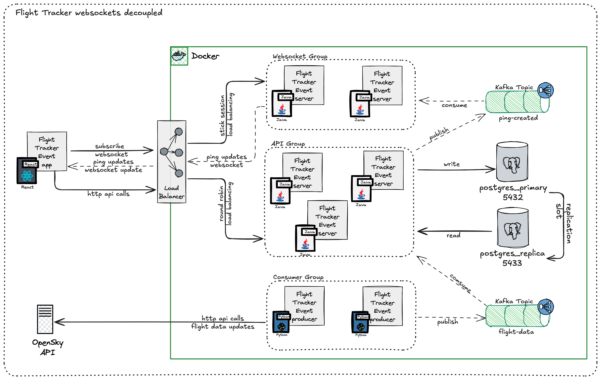

# Flight Tracker Event Server


## Table of Contents

- [Build Status](#build-status)
- [Features](#features)
- [Prerequisites](#prerequisites)
- [Configuration](#configuration)
  - [Kafka Configuration](#kafka-configuration)
    - [Component Control](#component-control)
  - [Database](#database)
    - [Benefits of Write/Read Replicas](#benefits-of-writeread-replicas)
    - [When to Use Write/Read Replicas](#when-to-use-writeread-replicas)
    - [Configuration](#configuration-1)
    - [How Datasource Routing Works](#how-datasource-routing-works)
  - [Redis](#redis)
  - [Clock Configuration](#clock-configuration)
  - [API Documentation](#api-documentation)
- [Development](#development)
  - [Running the Application](#running-the-application)
  - [Testing](#testing)
- [API Documentation](#api-documentation-1)
- [Getting Started](#getting-started)
  - [External Dependencies](#external-dependencies)
  - [Using Docker Compose](#using-docker-compose)
  - [Service Details](#service-details)
  - [Manual Service Management](#manual-service-management)
  - [Cloning the Repository](#cloning-the-repository)
  - [Building](#building)
- [Contributing](#contributing)
- [GitHub Actions Permissions](#github-actions-permissions)
- [Read Write Datasource Routing](#read-write-datasource-routing)
- [Project Structure](#project-structure)
- [Analysis and Decisions](#analysis-and-decisions)
  - [Architecture Decision Records (ADRs)](#architecture-decision-records-adrs)
  - [Technical Analysis](#technical-analysis)
- [License](#license)

A Spring Boot application for tracking flight events.

## Build Status

[](https://github.com/luismr/flight-tracker-event-server-java/actions/workflows/maven.yml)


## Features

- Real-time flight position tracking
- Kafka-based event streaming
- PostgreSQL database with read-write routing
- Redis caching
- Swagger/OpenAPI documentation
- Configurable timezone support

## Prerequisites

- Java 17 or later
- Docker and Docker Compose
- PostgreSQL
- Redis
- Kafka

## Configuration

The application can be configured through `application.yml`. Key configurations include:

### Kafka Configuration

The application uses Kafka for event streaming and real-time data processing. Here's the complete Kafka configuration:

```yaml
spring:
  kafka:
    bootstrap-servers: localhost:9092
    consumer:
      group-id: flight-tracker-group
      auto-offset-reset: earliest
      key-deserializer: org.apache.kafka.common.serialization.StringDeserializer
      value-deserializer: org.springframework.kafka.support.serializer.JsonDeserializer
      properties:
        spring.json.trusted.packages: "dev.luismachadoreis.flighttracker.server.ping.application.dto"
    topic:
      flight-positions: flight-positions
      ping-created: ping-created
```

#### Component Control

You can enable or disable various Kafka components and WebSocket notifications:

```yaml
app:
  flight-data:
    subscriber:
      enabled: true  # Enable/disable flight data Kafka subscriber
  ping:
    subscriber:
      enabled: true  # Enable/disable ping Kafka subscriber
    publisher:
      enabled: true  # Enable/disable ping Kafka publisher
    websocket:
      enabled: true  # Enable/disable WebSocket notifications
```
  

These settings allow you to:
- Control Kafka message consumption for flight data
- Control Kafka message consumption for ping events
- Control Kafka message publishing for ping events
- Enable/disable WebSocket real-time notifications

### Database

The application supports a Write/Read replica pattern for database operations. This pattern separates read and write operations to different database instances, providing several benefits:

  

#### Benefits of Write/Read Replicas

1. **Improved Read Performance**
   - Read operations are distributed across multiple replicas
   - Reduced load on the primary database
   - Better scalability for read-heavy workloads

2. **High Availability**
   - If the primary database fails, read replicas can continue serving read requests
   - Automatic failover capabilities
   - Reduced downtime impact

3. **Geographic Distribution**
   - Read replicas can be placed closer to users
   - Reduced latency for read operations
   - Better global performance

#### When to Use Write/Read Replicas

Consider implementing Write/Read replicas when:
- Your application has a high read-to-write ratio (e.g., 80% reads, 20% writes)
- You need to scale read operations independently
- You require high availability and disaster recovery
- You have geographically distributed users
- Your application has reporting or analytics features that require heavy read operations

#### Configuration

```yaml
spring:
  datasource:
    writer:
      jdbcUrl: jdbc:postgresql://localhost:5432/flighttracker
      username: flighttracker
      password: flighttracker
    reader:
      jdbcUrl: jdbc:postgresql://localhost:5433/flighttracker
      username: flighttracker
      password: flighttracker
```

#### How Datasource Routing Works

The application uses Spring's `@Transactional` annotation to determine which datasource to use. Here's how it works:

  

1. **Read Operations**
   ```java
   @Transactional(readOnly = true)
   public List<Flight> getRecentFlights() {
       // This will use the reader datasource
       return flightRepository.findAll();
   }
   ```

2. **Write Operations**
   ```java
   @Transactional
   public void saveFlight(Flight flight) {
       // This will use the writer datasource
       flightRepository.save(flight);
   }
   ```

3. **Mixed Operations**
   ```java
   @Transactional
   public void updateFlightStatus(String flightId, Status newStatus) {
       // This will use the writer datasource for the entire method
       Flight flight = flightRepository.findById(flightId);
       flight.setStatus(newStatus);
       flightRepository.save(flight);
   }
   ```

The routing is handled by:
- `ReadWriteRoutingAspect`: Intercepts `@Transactional` annotations
- `DbContextHolder`: Maintains the current context in a ThreadLocal
- `RoutingDataSource`: Routes the request to the appropriate datasource

**Important Notes:**
- Methods without `@Transactional` will use the writer datasource by default
- Nested transactions inherit the datasource from the outer transaction
- The `readOnly` flag is the key to determining which datasource to use

### Redis

```yaml
spring:
  redis:
    host: localhost
    port: 6379
```

### Clock Configuration

The application uses a configurable clock for timestamp operations. By default, it uses UTC:

```yaml
app:
  clock:
    timezone: UTC
```

You can change the timezone to any valid timezone ID (e.g., "America/New_York", "Europe/London"):

```yaml
app:
  clock:
    timezone: America/New_York
```

### API Documentation

Swagger UI is available at `/swagger-ui.html` with the following configuration:

```yaml
springdoc:
  api-docs:
    path: /api-docs
  swagger-ui:
    path: /swagger-ui.html
```

## Development

### Running the Application

1. Start the required services using Docker Compose:
   ```bash
   docker-compose up -d
   ```

2. Run the application:
   ```bash
   ./mvnw spring-boot:run
   ```

### Testing

Run the tests:
```bash
./mvnw test
```

## API Documentation

The API documentation is available at:
- Swagger UI: http://localhost:8080/swagger-ui.html
- OpenAPI JSON: http://localhost:8080/api-docs

## Getting Started

### External Dependencies

The application requires the following external services:

- Redis 7.4
- PostgreSQL 17
- Apache Kafka 4

#### Using Docker Compose

The project includes a `docker-compose.yml`